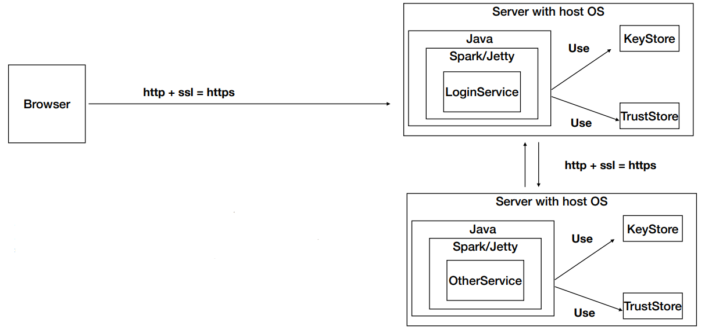
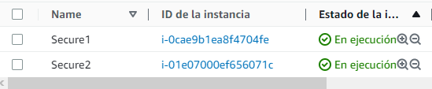
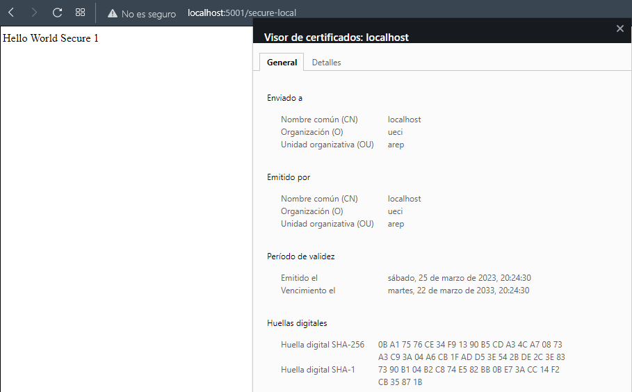
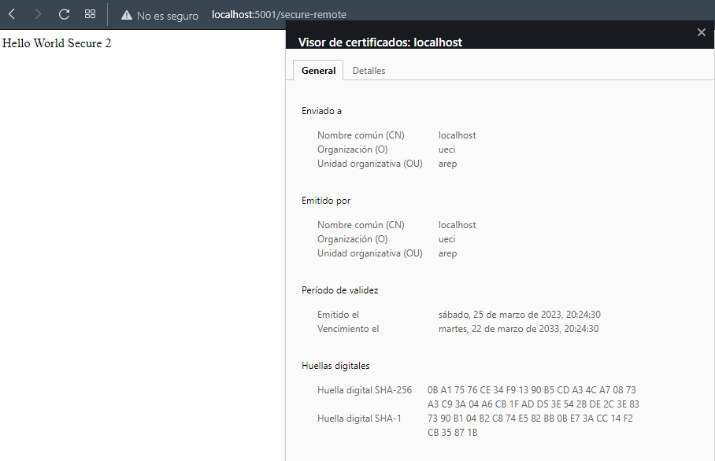
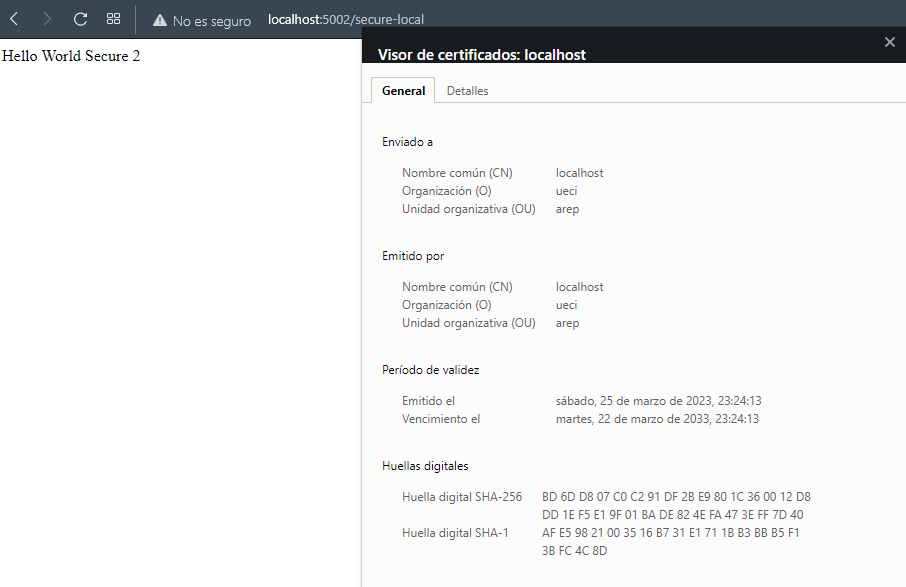
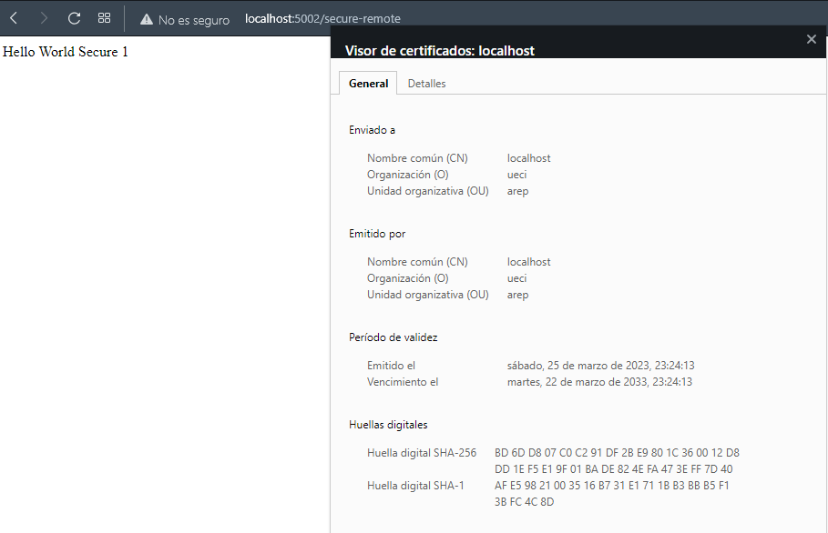
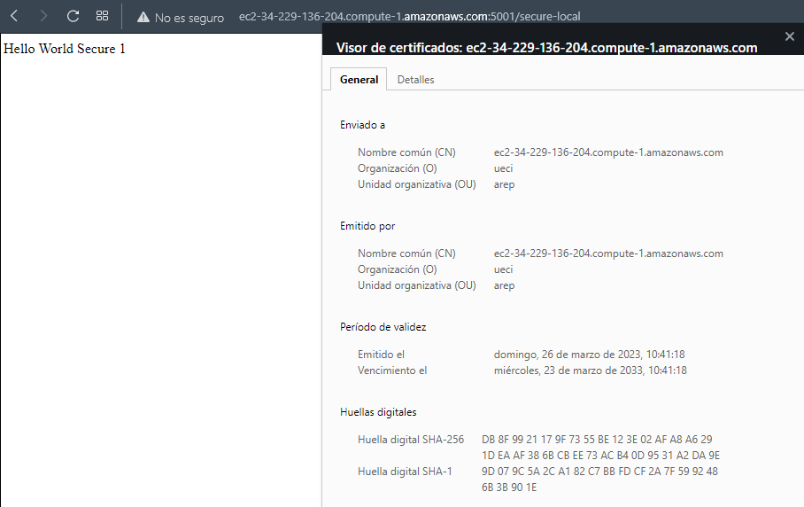
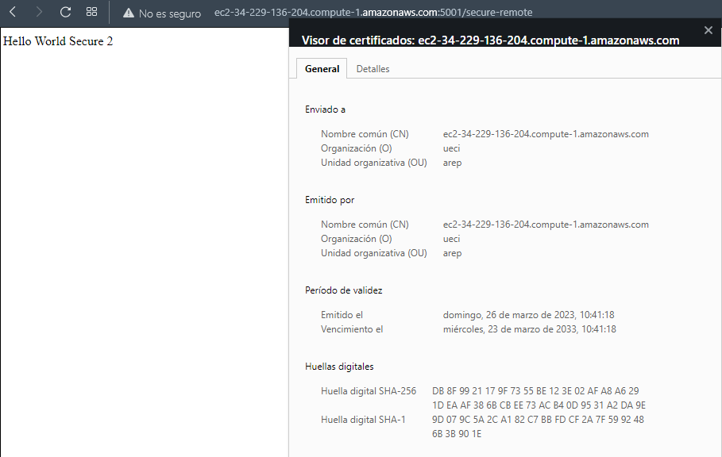
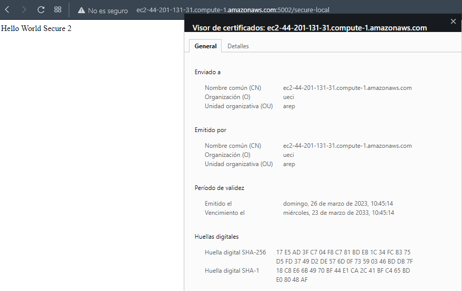
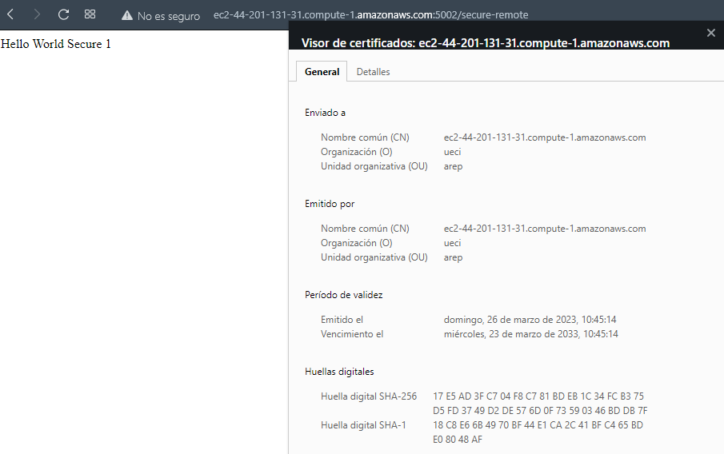

## Escuela Colombiana de Ingeniería
# APLICACIÓN DISTRIBUIDA SEGURA EN TODOS SUS FRENTES

Desarrolle una aplicación Web segura con los siguientes requerimientos:

1. Debe permitir un acceso seguro desde el browser a la aplicación. Es decir debe garantizar autenticación, autorización e integridad de usuarios.

2. Debe tener al menos dos computadores comunicándose entre ellos y el acceso de servicios remotos debe garantizar: autenticación, autorización e integridad entre los servicios. Nadie puede invocar los servicios si no está autorizado.

3. Explique como escalaría su arquitectura de seguridad para incorporar nuevos servicios.

## Clonación del proyecto

Para descargar este proyecto, debe ejecutar el siguiente comando para descargar el proyecto:

```
https://github.com/JuanPablo70/AREP-TALLER07.git
```

### Prerrequisitos

Para hacer uso de esta aplicación debe tener conocimientos de:
+ Java - Lenguaje de programación orientado a objetos.
+ Maven - Herramienta para automatizar la gestión y construcción de proyectos Java. 
+ AWS - Plataforma de computación en la nube.

## Descripción del proyecto

El proyecto está diseñado como se ve en la imagen de abajo donde un browser hace peticiones https a dos instancias EC2 creadas en AWS. Cada instancia tiene un recurso sencillo con un saludo y a su vez las instancias pueden hacerse peticiones https entre ellas.



### Certificados

Para crear los certificados ssl, se ejecutaron los siguientes comandos:

Llaves públicas, privadas y certificado.

```
keytool -genkeypair -alias ecikeypair -keyalg RSA -keysize 2048 -storetype PKCS12 -keystore ecikeystore.p12 -validity 3650
```

Exportar certificado a un archivo

Se debe colocar en el nombre y apellido la DNS pública de la instancia en AWS.

```
keytool -export -keystore ./ecikeystore.p12 -alias ecikeypair -storetype PKCS12 -file ecicert.cer
```

Importar el certificado a un TrustStore

```
keytool -storetype PKCS12 -import -file ./ecicert.cer -alias firstCA -keystore myTrustStore.p12
```

### Instancias AWS



No olvidar abrir los puertos que se vayan a utilizar, en este caso para la instancia Service1 y Service2 se abrieron los puertos 5001 y 5002 respectivamente.

1. Instalar Java, en este caso Java 8 con el siguiente comando:

```
sudo yum install java-1.8.0-amazon-corretto-devel

java -version
```

2. A través de una conexión sftp, copiar el target del proyecto en un zip con el directorio keystores donde se crearon los certificados a cada una de las instancias.

3. Ejecutar los siguientes comandos en Service1 y Service2 respectivamente:

```
java -cp "target/classes:target/dependency/*" edu.eci.arep.service1.HelloWorldSecure1

java -cp "target/classes:target/dependency/*" edu.eci.arep.service2.HelloWorldSecure2
```

## Test

Para este proyecto se realizaron dos pruebas, local y remota en AWS.

### Local

- Service1



Service1 a Service2



- Service2



Service2 a Service1



### Remota en AWS

- Service1



Service1 a Service2



- Service2



Service2 a Service1



#### Video explicativo en vivo: https://drive.google.com/file/d/1ZVloABwfeQqsoZRNeLlxZlfKYl3UNWty/view?usp=sharing

## Construido con

+ [Maven](https://maven.apache.org/) - Dependency Management
+ [AWS](https://aws.amazon.com/es/) - Cloud Platform

## Versión

1.0

## Autor

Juan Pablo Sánchez Bermúdez
